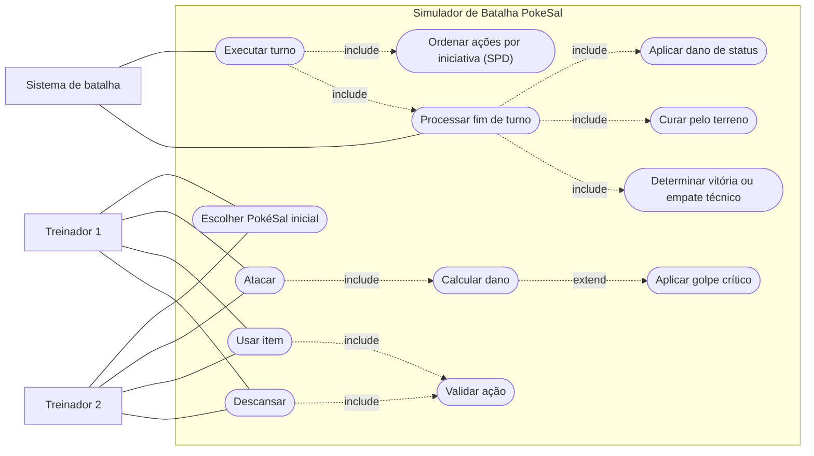

# Diagrama de Casos de Uso — PokeSal (Fase 1)

Baseado nas ações e regras implementadas em `Batalha` e nos itens do documento
de análise estática. O Mermaid não tem um tipo "casos de uso" próprio, então o
diagrama usa um fluxograma: atores como retângulos, casos de uso como elipses,
`include` e `extend` como setas tracejadas.

## Descrição resumida

| Caso de uso | Regra principal | Documento |
|---|---|---|
| Escolher PokéSal inicial | Cada treinador escolhe 1 entre os 6 PokéSal | 1.1 |
| Atacar | Dano = ATK − DEF/2, com elemental, terreno e crítico | 1.4, 1.17 |
| Usar item | Potion, Super Potion e Antidote; máximo de 2 usos por treinador | 1.21–1.23 |
| Descansar | Recupera 10% do HP máximo, uma vez por treinador | 3.2 |
| Ordenar ações por iniciativa | SPD efetivo; desempate por ATK-base e depois Treinador 1 | 1.8–1.10 |
| Aplicar golpe crítico | 10% de chance, dano x1,5 (fonte injetável nos testes) | 3.1 |
| Validar ação | Estoque, efeito possível, PokéSal com 0 HP, limite de usos | 1.23, 1.26 |
| Processar fim de turno | Status, verificação de derrota, cura do terreno (nessa ordem) | 1.11 |
| Determinar vitória ou empate | Derrota simples ou duplo KO (empate técnico) | 1.24 |
