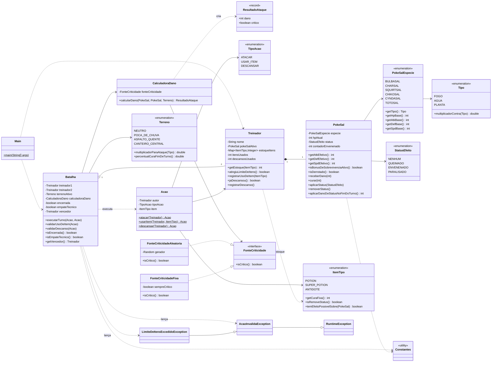

# Diagrama de Classes — PokeSal (Fase 1)

Gerado a partir do código em `src/main/java/pokesal`. O GitHub e a extensão
*Markdown Preview Mermaid Support* do VS Code renderizam o diagrama abaixo.

```mermaid
classDiagram
    direction LR

    class Main {
        +main(String[] args)$
    }

    class Batalha {
        -Treinador treinador1
        -Treinador treinador2
        -Terreno terrenoAtivo
        -CalculadoraDano calculadoraDano
        -boolean encerrada
        -boolean empateTecnico
        -Treinador vencedor
        +executarTurno(Acao, Acao)
        +validarUsoDeItem(Acao)
        +validarDescanso(Acao)
        +isEncerrada() boolean
        +isEmpateTecnico() boolean
        +getVencedor() Treinador
    }

    class CalculadoraDano {
        -FonteCriticidade fonteCriticidade
        +calcularDano(PokeSal, PokeSal, Terreno) ResultadoAtaque
    }

    class ResultadoAtaque {
        <<record>>
        +int dano
        +boolean critico
    }

    class Acao {
        -Treinador autor
        -TipoAcao tipoAcao
        -ItemTipo item
        +atacar(Treinador)$ Acao
        +usarItem(Treinador, ItemTipo)$ Acao
        +descansar(Treinador)$ Acao
    }

    class TipoAcao {
        <<enumeration>>
        ATACAR
        USAR_ITEM
        DESCANSAR
    }

    class Treinador {
        -String nome
        -PokeSal pokeSalAtivo
        -Map~ItemTipo,Integer~ estoqueItens
        -int itensUsados
        -int descansosUsados
        +getEstoque(ItemTipo) int
        +atingiuLimiteDeItens() boolean
        +registrarUsoDeItem(ItemTipo)
        +jaDescansou() boolean
        +registrarDescanso()
    }

    class PokeSal {
        -PokeSalEspecie especie
        -int hpAtual
        -StatusEfeito status
        -int contadorEnvenenado
        +getAtkEfetivo() int
        +getDefEfetivo() int
        +getSpdEfetivo() int
        +isBonusDeSobrevivenciaAtivo() boolean
        +isDerrotado() boolean
        +receberDano(int)
        +curar(int)
        +aplicarStatus(StatusEfeito)
        +removerStatus()
        +aplicarDanoDeStatusNoFimDoTurno() int
    }

    class PokeSalEspecie {
        <<enumeration>>
        BULBASAL
        CHARSAL
        SQUIRTSAL
        CHIKOSAL
        CYNDASAL
        TOTOSAL
        +getTipo() Tipo
        +getHpBase() int
        +getAtkBase() int
        +getDefBase() int
        +getSpdBase() int
    }

    class Tipo {
        <<enumeration>>
        FOGO
        AGUA
        PLANTA
        +multiplicadorContra(Tipo) double
    }

    class StatusEfeito {
        <<enumeration>>
        NENHUM
        QUEIMADO
        ENVENENADO
        PARALISADO
    }

    class Terreno {
        <<enumeration>>
        NEUTRO
        POCA_DE_CHUVA
        ASFALTO_QUENTE
        CANTEIRO_CENTRAL
        +multiplicadorParaAtaque(Tipo) double
        +percentualCuraFimDeTurno() double
    }

    class ItemTipo {
        <<enumeration>>
        POTION
        SUPER_POTION
        ANTIDOTE
        +getCuraFixa() int
        +isRemoveStatus() boolean
        +temEfeitoPossivelSobre(PokeSal) boolean
    }

    class FonteCriticidade {
        <<interface>>
        +isCritico() boolean
    }

    class FonteCriticidadeAleatoria {
        -Random gerador
        +isCritico() boolean
    }

    class FonteCriticidadeFixa {
        -boolean sempreCritico
        +isCritico() boolean
    }

    class Constantes {
        <<utility>>
    }

    class AcaoInvalidaException
    class LimiteDeItensExcedidoException
    class RuntimeException

    Main ..> Batalha
    Main ..> Treinador
    Batalha "1" o-- "2" Treinador
    Batalha --> Terreno
    Batalha --> CalculadoraDano
    Batalha ..> Acao : executa
    Batalha ..> AcaoInvalidaException : lança
    Batalha ..> LimiteDeItensExcedidoException : lança
    CalculadoraDano --> FonteCriticidade
    CalculadoraDano ..> ResultadoAtaque : cria
    Acao --> Treinador
    Acao --> TipoAcao
    Acao --> ItemTipo
    Treinador "1" *-- "1" PokeSal
    Treinador ..> ItemTipo : estoque
    PokeSal --> PokeSalEspecie
    PokeSal --> StatusEfeito
    PokeSalEspecie --> Tipo
    FonteCriticidadeAleatoria ..|> FonteCriticidade
    FonteCriticidadeFixa ..|> FonteCriticidade
    LimiteDeItensExcedidoException --|> AcaoInvalidaException
    AcaoInvalidaException --|> RuntimeException
    Batalha ..> Constantes
    PokeSal ..> Constantes
```
